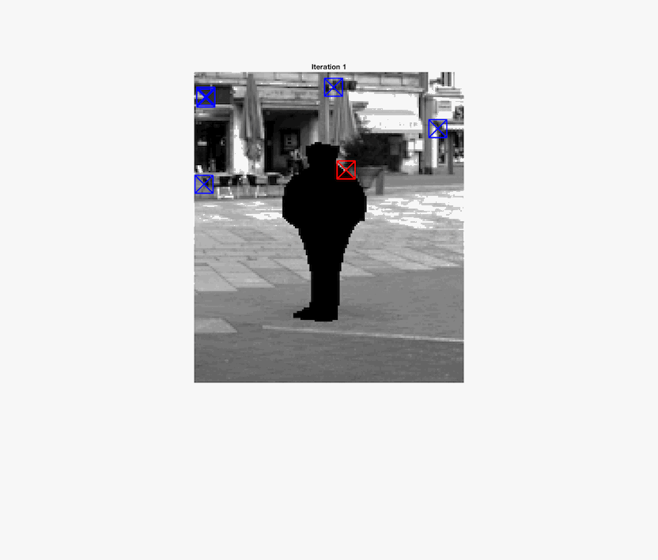

# Image Reconstruction Algorithm

Creating from scratch (in MATLAB) the image in-painting algorithm proposed by Rodriguez et. al (paper included in repo)

**_For complete write up, download the repo and open html/main.hmtl for the code + explanation of work_**.

In collaboration with Thomas Akdeniz and Kristoff Malejczuk.

# Summary

For an inpainting problem, one must consider two factors: intensity and texture. "Consistent
intensity is needed when connecting lines or recovering edges having similar intensity, whereas consistent texture is needed when reconstructing large missing regions having texture patterns." 

The proposed solution is a three part solution that measures intensity similarity and texture similarity between a target patch (patch with fractional amounts of missing pixels) and candidate patches (patches where all pixel values are known). This algorithm can be applied to RGB or grayscale images. The code in this repo is for grayscale, though it is possible to extend it to RGB.

Algorithm:

1) Using a priority function, determine which missing patch to fill in next (target patch). The chosen target patch is along the perimiter of the missing region, where the patch is partially overlapping with a set of known and unknown pixels.

2) Using a nonlocal texture similarity (NLTS) function, determine candidate patches (number of candidate patches is a hyperparameter, call it λ). The function treats the original image to be composed of overlapping smaller patches and since it is a nonlocal function, the NLTS function finds the best candidate patches across the entire image that can help fill in the missing pixels in the target patch. 

3) To determine the pixel values of the missing pixels in the target patch (intensity matching), use an alpha-trimmed mean filter (α is a hyperparameter). 

Alpha-trimmed mean filter:

For each missing pixel in the target patch, determine the corresponing pixel intensity at the same co-ordinate of all the candidate patches and sort them in ascending order. Drop the αλ largest and smallest values. Sum the remaining intensity values and normalize by dividing by λ-2αλ. 

The above algorithm is repeated until all target patches are filled. 

We use the alpha-trimmed mean instead of the full mean because it is less sensitive to outliers in the candidate patches.

# Sample Results 
Below are two sample runs of our implementation of the algorithm. The red box indicates the chosen missing patch and the blue boxes indicate the λ candidate patches.

